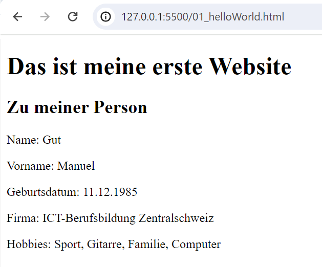

# Deine erste Website

Nachdem wir nun die IDE installiert haben, ist es an der Zeit, dass du deine erste Website erstellst. Lege dazu ein File **01\_helloWorld.html** an.&#x20;

Danach kannst du das Template von [**hier**](html-template.md) kopieren. Noch einfacher geht es aber, wenn du dir das Template einfach von VS Code anlegen lässt. Dazu einfach ein **Ausrufezeichen** eintippen und über die Autovervollständigung mittels **Tabulator-Taste** das Template generieren lassen.&#x20;

Nun suchst du darin das **Body-Element**. Beachte, dass es bei jedem Element ein sogenanntes **Start-Tag** und ein dazugehöriges **End-Tag** gibt. Bei uns ist das Start-Tag **\<body**> und das Endtag **\</body>**. Grundsätzlich kannst du dir merken, dass Start- und End-Tag immer identisch heissen, das Endtag aber einen Slash vor dem Tag-Namen hat. Zwischen Start- und End-Tag fügst du nun den nachfolgenden Code ein.&#x20;

```html
    <h1>Das ist meine erste Website</h1>
    <h2>Zu meiner Person</h2>
    <p>Name:</p>
    <p>Vorname:</p>
    <p>Geburtsdatum:</p>
    <p>Firma:</p>
    <p>Hobbies:</p>
```

Hinter den Doppelpunkten kannst du nun die entsprechenden Informationen zu deiner Person ergänzen.

So, nun wollen wira aber wissen, wie das ganze "live" dann aussehen wird. Dafür nutzen wir das zuvor installierte Plugin "Live Server"  Dazu unten rechts auf "Go Live" klicken. Dadurch öffnet sich ein neues Browser-Tab, welches deine Website enthält. Das wird dann ungefähr so aussehen:

<figure><figcaption><p>Beispiel "Meine erste Website".</p></figcaption></figure>

In der **URL des Browsers** kannst du sehen, dass wir uns auf einem Server mit der **IP-Adresse 127.0.0.1** befinden. Dies ist der sogenannte "**local host**", also dein eigener Laptop. Klingt etwas verwirrend, doch über das Plugin "Live Server" fungiert dein eigener Laptop nun gleichzeitig als **Server** und als **Client**. So kannst du über deinen **Browser (Client)** den **Live Server (Server)** anfragen. Dazu wird der **Port 5500** verwendet, was du hinter dem **Doppelpunkt** in der URL siehst. Danach folgt ein **Slash** gefolgt von **01\_helloWorld.html**, was der **Bezeichnung deines Files** entspricht und als **Pfad** bezeichnet wird.
