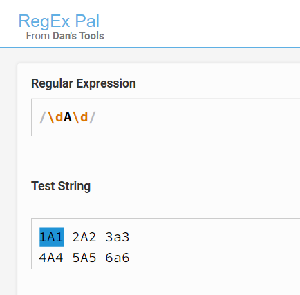

# Regular Expression Flags

Grundsätzlich gibt es 4 verschiedene Flags:

* **g = global flag**: Sucht alle vorkommenden matches, nicht nur das erste
* **i = case insensitive flag**: ignoriert Gross- und Kleinschreibung
* **m = multiline flag**: Sucht auch nach linebreak weiter.
* **s = dot all flag**:&#x20;

Nachfolgend siehst du das unterschiedliche Verhalten anhand des Tools RegEx Pal

**Ohne global flag:**

<figure><figcaption></figcaption></figure>

**Mit global flag:**

<figure><figcaption></figcaption></figure>

**Mit global und multiline flag:**

